# <div align="center">


<p align="center">
  <a href="https://github.com/PrakashWebDevX">
    
  </a>
  <a href="https://www.linkedin.com/in/prakashrue">
    
  </a>
  <a href="https://prtech.netlify.app">
    
  </a>
</p>


---

## 💼 Professional Snapshot

> I engineer intelligent AI systems, premium web interfaces, and autonomous agents under **PRTECH.AI**.

- 🚀 AI Software Developer
- 🤖 Multi-Agent AI Engineer
- ⚡ LangGraph • RAG • LLM Orchestration
- 🌐 Full Stack Developer
- 🎨 Glassmorphism + Motion UI Enthusiast

---

## ⚡ AI Runtime Status

```terminal
$ boot PRTECH.AI

██████████████████████████████ 100%

✓ AI Agent Developer
✓ LangGraph Architect
✓ Generative AI Builder
✓ Full Stack Engineer
✓ Engineering Intelligent Digital Experiences
```

---

## 🛠️ Technical Arsenal

<p align="center">

</p>

---

## 👨‍💻 AI Identity Panel

<table>
<tr>
<td width="40%">

</td>
<td width="60%">

</td>
</tr>
</table>

---

## 🚀 GitHub Analytics

<div align="center">


</div>

---

# 🏆 GitHub Achievements

<div align="center">


<br><br>


<br><br>


</div>
---

## 🐍 Contribution Snake

<p align="center">
  
</p>

---

## 📈 Contribution Activity

<p align="center">
  
  
</p>

---

## 🌌 Featured Projects

| 🚀 Project | Description | Stack |
|------------|-------------|-------|
| **PRTECH.AI** | Premium AI & Software Development Agency. | Next.js • React • AI |
| **RP Vision AI** | AI Image Generation + Background Removal + Upscaling. | React • Node.js |
| **Codex Campus AI** | RAG-powered College Knowledge Assistant. | FastAPI • Supabase |
| **AI Business Research Agent** | Multi-Agent AI using LangGraph + RAG. | Python • LangGraph |
| **AutoEvent AI** | AI-powered Event Media Generator. | OpenAI • Next.js |

---

## 🌍 Connect With Me

<p align="center">
<a href="https://github.com/PrakashWebDevX">

</a>
<a href="https://www.linkedin.com/in/prakashrue">

</a>
<a href="https://prtech.netlify.app">

</a>
</p>

---

## 💡 Current Focus

```yaml
Learning:
  - Multi-Agent AI
  - LangGraph
  - MCP
  - AI Automation

Building:
  - PRTECH.AI
  - RP Vision AI
  - Codex Campus Assistant
  - AI Research Agents
```

---

## ✨ Developer Philosophy

> **"Code is temporary. Intelligence is scalable. Build systems that think, learn, and evolve."**

---

<p align="center">

</p>

### ⚙️ Powered by PRTECH.AI

*Engineering Intelligent Agents • Building the Future with AI*

</div>
