### 💼 Professional Snapshot

I am a highly motivated developer merging the worlds of **Artificial Intelligence** and **Premium Digital Interfaces**. Whether it's spinning up full-stack web applications capable of generating AI imagery or engineering massive 3D environments that react to physical hand gestures using WebGL, my main focus is **pushing the boundaries of what the browser can do.**

- 🚀 Currently working on scaling Next.js & React-based Generative AI platforms.
- 🎨 Passionate about Glassmorphism, Micro-animations, and striking UX/UI logic.
- 💡 Actively seeking roles/collaborations that challenge modern web paradigms!

### 🛠️ Technical Arsenal

 

<h3><code>$ cat contributions.log</code></h3>

  

<h3><code>$ whoami --verbose</code></h3>

<table>
  <tr>
    <td valign="top"></td>
    <td valign="top"></td>
  </tr>
</table>

 

<h3><code>$ ls projects/ --pinned</code></h3>

| Status | Project | Description | Tech Highlight |
|---|---|---|---|
| 👑 | [**PR TECH Agency**](https://prtech.netlify.app/) | My premium Web Design, Software Development, and AI Solutions agency, architecting digital futures for clients. | `Custom Logic`, `B2B` |
| 🌌 | [**AI Business Research Agent**](https://github.com/PrakashWebDevX/AI-Business-Research-Agent-Backend) | Autonomous, tool-using AI agent that answers business questions by routing between an internal SQL database and live web search. | `Python`, `LangChain`, `LLM`, `RAG` |
| 🤖 | [**RP Vision AI**](https://github.com/PrakashWebDevX/RPVisionAI-Tool) | Flagship Gen-AI suite for text-to-image generation, background removal, and photo upscaling — free & open source. | `React`, `Node.js`, `Rest APIs` |

*"Any sufficiently advanced technology is indistinguishable from magic."*

<!--
  How this works:
  - GitHub strips <script> tags and most inline CSS from markdown, but
    an  pointing at a local .svg is just rendered as an image —
    and that image is free to animate itself via SMIL / embedded <style>.
  - portrait.svg / sysinfo.svg / graph.svg are generated locally by the
    scripts in tools/, then committed as flat files — no external
    stats-widget services, tokens, or client-side JS involved.
  - Only graph.svg needs to change day to day, so the GitHub Actions
    workflow (.github/workflows/refresh-graph.yml) re-pulls contribution
    data and re-renders just that file once a day.
  - Theme: neon-cyan (#00FFCC) on GitHub-dark (#0D1117), matching the
    existing activity-graph/streak badge colors this replaces.

  To rebuild after swapping in a new photo:
      python -m venv .venv && source .venv/bin/activate
      pip install -r tools/requirements-art.txt
      python tools/clean_photo.py my-photo.jpg
      python tools/render_portrait.py

  To rebuild the info panel after editing tools/render_panel.py:
      python tools/render_panel.py
-->
